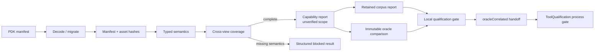

# PDKKit Capability and Limitation Report

## Implemented capabilities

| Capability | Evidence | Result |
|---|---|---|
| Versioned manifest decode and legacy migration | `PDKManifestCodec`, migration tests | Available |
| Immutable PDK identity and manifest digest | `PDKManifestReferenceBuilder`, SHA-256 test | Available |
| Local recursive discovery | `LocalPDKDiscoverer`, discovery test | Available |
| Manifest-relative asset resolution | `LocalPDKAssetResolver`, validation fixture | Available |
| Asset SHA-256 and byte-count integrity | `CircuiteFoundation.LocalArtifactReferencer`/`LocalArtifactVerifier` through `LocalPDKAssetResolver` and `LocalPDKValidator`, negative-path tests | Available |
| Layer, device and extraction semantics | Typed `PDKCore` models and validator | Available when declared |
| PVT/RC/EM/reliability corner model | `PDKCornerDefinition` and scope export | Available when declared |
| Cross-view mapping coverage | layer/device/corner coverage checks | Blocked when mappings are absent |
| Manifest-bound cross-view semantic validation | `LocalPDKValidator` invokes the manifest-bound LEF/GDSII/OASIS/SPICE/Liberty inspectors and retains `standardViewResults` | Available for declared mappings; parser failures and semantic blockers fail closed |
| Rule-deck semantic validation | `PDKRuleDeckInspecting`, `LocalPDKRuleDeckInspector`, `PDKRuleDeckInspectionPayload`, `ruleDeckResults` and `pdkkit inspect-rule-deck` | Available for declared text rule decks; grammar limitations and missing layer evidence block |
| Retained corpus evaluation | `PDKCorpusSuite`, `LocalPDKCorpusValidator`, standard-view and rule-deck case results, valid/blocked/failed fixture cases | Available for declared local cases; schema v2 accepts legacy v1 suites |
| Standard-view detailed inspection | `PDKStandardViews`, `swift-mask-data` readers, SPICE/Liberty text adapters, canonical IR and manifest binding | Available for supported mask structure, numeric SPICE model parameters, Liberty timing tables and units |
| External backend envelope parity | `PDKExternalStandardViewResultProviding`, `PDKExternalRuleDeckResultProviding`, external inspectors and contract tests | Available for shared typed result envelopes and digest-bearing source-reference binding; external process execution and qualification remain open |
| Immutable oracle comparison | `PDKOracleExpectation`, `LocalPDKOracleComparator`, mismatch payload | Available for declared canonical facts |
| Local qualification gate | `PDKQualificationGate`, digest-bound corpus + oracle evidence | Available for `oracleCorrelated` handoff |
| Qualification artifact evaluator | `PDKQualificationRequest`, `LocalPDKQualificationEvaluator` | Available for immutable payload/envelope artifacts |
| Deterministic JSON API surface | `pdkkit inspect/discover/validate/corpus/inspect-view/inspect-rule-deck/oracle/qualify` | Available |
| Xcircuite stage execution | six PDK adapters, immutable envelopes, agent-facing runtime specs and approval/resume flow | Available for the PDK integration slice; release adapter contract is available across the workspace |

## Explicit limitations

- This package does not run DRC, LVS, PEX or simulation.
- External backend adapters validate a shared result envelope but do not start
  external tools, discover binaries, persist process logs or establish
  process-scoped qualification. Those responsibilities remain with
  Xcircuite/SignoffToolSupport and ToolQualification.
- This package does not replace format-specific LEF, GDSII/OASIS, SPICE or
  Liberty parsers. A raw file without a typed mapping is insufficient evidence
  and blocks validation.
- LEF/GDSII/OASIS inspection reuses the workspace `swift-mask-data` readers;
  SPICE/Liberty adapters retain canonical model parameters, subcircuits, cells,
  timing arcs, timing table indices/values and unit declarations. Unsupported
  expressions, incomplete tables and dimension mismatches are blocked. Complete
  coverage of every vendor-specific model/table construct remains open.
- The retained oracle is a local immutable detailed expectation. It is not a
  foundry reference tool, and no process-specific qualification is included.
- The retained corpus is a contract corpus. It does not contain foundry
  process evidence and does not parse every standard-format view.
- `qualificationState` remains `unverified`; ToolQualification owns promotion
  to a process-scoped qualified state.
- ToolQualification scope matching is enforced at the Xcircuite trust gate for
  the PDK slice. The workspace also defines an independent
  `ToolProcessQualificationEvidence` artifact and a ReleaseEngine fail-closed
  consumer. The checked-in fixture provides contract evidence only; it does
  not establish an independent process qualification.

## Evidence flow

