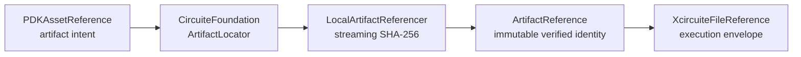

# PDKKit

Canonical process-design-kit discovery, identity, asset integrity and validation contracts.

## Status

The PDKKit-owned contract layer is complete and executable for deterministic manifest-driven discovery,
validation, retained corpus evaluation and parser-backed standard-view
inspection, detailed numeric semantics, immutable Foundation-backed artifact provenance, oracle comparison and a local qualification gate. The
PDK stage slice is also executable through Xcircuite with immutable artifacts,
scope-bound tool evidence, human approval and resume coverage. The larger
platform goal requires separate provider evidence and foundry approval; PDKKit
represents unsupported vendor-specific constructs as explicit blocked results.
External standard-view and rule-deck backends can now return the same typed
result envelopes as the local inspectors. The adapters fail closed on envelope
schema, run, asset, format, source-reference and PDK-digest mismatches; they do not execute or
qualify an external process by themselves.
The workspace now provides typed
process-qualification and release-eligibility contracts in ToolQualification,
ReleaseEngine and Xcircuite, but this package does not manufacture the
independent evidence required to pass those gates.

## Products

| Product | Responsibility |
|---|---|
| `PDKCore` | PDK identity and immutable manifest reference |
| `PDKDiscovery` | Deterministic local PDK discovery without qualification claims |
| `PDKValidation` | Manifest, input, asset, digest, parser-backed cross-view, retained corpus and local qualification gate |
| `PDKStandardViews` | Canonical standard-view and rule-deck inspection, local/external envelope adapters, manifest binding and immutable oracle comparison |
| `PDKKit` | Umbrella API and public contract version (2) |
| `PDKKitCLICore` / `pdkkit` | Deterministic JSON inspection, discovery, validation, corpus, standard-view, rule-deck, oracle and qualification CLI |

## Contract

Every executing product uses:

- a `Codable`, `Hashable`, `Sendable` request conforming to `XcircuiteEngineRequest`;
- `XcircuiteEngineResultEnvelope<Payload>` for status, diagnostics, artifacts and execution metadata;
- protocol-first dependency injection;
- immutable artifact identities from CircuiteFoundation, projected to
  `XcircuiteFileReference` only where required by the current execution envelope;
- explicit blocked, failed and cancelled states.

The artifact boundary has two representations with different authority:



`ArtifactReference` is the integrity source of truth inside PDKCore. The
Xcircuite projection is retained for the current request/result envelope and
is validated from the Foundation identity; it does not replace the canonical
artifact contract. Standard-view IR, rule-deck inspection payloads and oracle
comparison payloads retain the same canonical identity, so every PDKKit-owned
artifact consumer observes one integrity boundary.

External providers conform to `PDKExternalStandardViewResultProviding` or
`PDKExternalRuleDeckResultProviding` and return JSON-encoded
`XcircuiteEngineResultEnvelope` payloads. `ExternalPDKStandardViewInspector`
and `ExternalPDKRuleDeckInspector` validate the shared envelope before the
result is consumed by manifest binding or downstream evidence. Source
references must match the requested digest-bearing input artifacts. Provider
process execution, tool discovery and process-scoped qualification remain
owned by Xcircuite/SignoffToolSupport and ToolQualification.

## Xcircuite integration

Xcircuite resolves a PDKReference before constructing downstream stage requests. Every physical or electrical stage records the same PDK digest.

The library does not depend on the Xcircuite runtime. Xcircuite owns the adapter to `DesignFlowKernel.FlowStageExecutor`, artifact persistence, qualification gates, repair loops and human approval.

The Xcircuite package provides discovery, validation, retained-corpus,
standard-view, oracle and qualification `FlowStageExecutor` adapters. The
agent-facing `XcircuiteFlowStageExecutorSpec` can encode and construct all six
PDK stages. Each adapter persists the complete engine envelope as an immutable
run artifact and maps completed, blocked, failed and cancelled states to flow
gates. Qualification evidence is accepted only when the ToolQualification
scope matches the requested implementation, binary, algorithm, process and
deck; the integration test also covers human approval followed by resume.

Relative artifact references are resolved against an explicit project root and
cannot escape it. Adapters pass the project root into PDKKit, so a persisted
run remains reproducible even when its inputs are stored as project-relative
references.

## Manifest contract

`PDKManifest` is the canonical process-scoped source of truth. It contains:

- process identity and version;
- immutable asset references and optional expected SHA-256/byte count;
- manufacturing layer and purpose semantics;
- device terminals and extraction recognition;
- PVT, RC, electromigration and reliability corner mappings;
- cross-view mappings for layer map, LEF/GDSII/OASIS, SPICE and Liberty views.

Schema version zero is migrated to the current schema, including legacy
`process`, `pdkVersion` and file-path fields. Unsupported or malformed schemas
produce typed errors.

Raw asset presence is not treated as semantic proof. Missing mappings, missing
assets, digest mismatches and unavailable semantics produce structured blocked
diagnostics instead of a false pass.

`pdkkit validate` now executes every declared LEF, GDSII/OASIS, SPICE and
Liberty mapping through the same manifest-bound inspectors used by
`inspect-view`. The payload retains one `standardViewResults` entry per mapped
view, including parser provenance, canonical facts, binding findings and the
completed/blocked/failed status. This makes manifest validation and standalone
inspection consume the same cross-view evidence.

Declared rule-deck assets are validated through `ruleDeckResults`: the deck
must be readable UTF-8 text, contain statements, have a `ruleDeck` layer
mapping and identify every mapped layer by name, alias or manufacturing number.
Use `--no-standard-views` or `--no-rule-decks` only when an agent explicitly
needs to isolate a contract layer during diagnosis.

`PDKRuleDeckInspectionRequest` and `PDKRuleDeckInspectionPayload` are the
standalone protocol-first form of that check. `LocalPDKRuleDeckInspector` and
`pdkkit inspect-rule-deck` expose the same immutable reference, mapped-layer
evidence and structured findings without requiring a full manifest validation
run. The adapter intentionally reports grammar limitations instead of claiming
complete vendor-specific DRC rule semantics.

The public package and CLI contract version is 2. The rule-deck stage is
identified as `pdk.inspect-rule-deck`; request schema evolution is independent
from the manifest schema.

`PDKCorpusSuite` and `LocalPDKCorpusValidator` retain expected valid, blocked
and failed cases. Corpus success is evidence of the declared local validator
and failed cases, including manifest-bound standard-view and rule-deck checks.
Rule-deck corpus results retain expected/observed outcomes and finding codes so
the artifact can be reviewed or resumed by an agent. Corpus success is evidence
of the declared local validator contract only; it does not promote the
qualification state.

`PDKOracleExpectation` binds canonical standard-view facts, numeric SPICE model
parameters, Liberty timing tables and unit declarations to a manifest digest.
`LocalPDKOracleComparator` returns structured field mismatches, and
`PDKQualificationGate` promotes only a matching local corpus plus oracle pair
to `oracleCorrelated`. It never emits `processQualified`.

## CLI

```bash
swift run pdkkit inspect --manifest <path> --pretty
swift run pdkkit discover --root <path> [--root <path> ...] --process-id <id>
swift run pdkkit validate --manifest <path> --required-role layerMap --pretty
swift run pdkkit corpus --suite <path> --root <path> --pretty
swift run pdkkit inspect-view --manifest <path> --asset-id <id> --format <lef|gdsii|oasis|spice|liberty> --pretty
swift run pdkkit inspect-rule-deck --manifest <path> --asset-id <id> --pretty
swift run pdkkit oracle --manifest <path> --oracle <path> --pretty
swift run pdkkit qualify --manifest <path> --corpus <report.json> --oracle <report.json> --pretty
```

The CLI writes deterministic sorted-key JSON to stdout. Domain blockers use
exit code `2`; argument, read and decode errors use exit code `1` and a single
structured diagnostic object on stderr.

## Build

```bash
swift build
```

## Test

```bash
perl -e 'alarm shift; exec @ARGV' 30 xcodebuild -quiet test -scheme PDKKit-Package -destination 'platform=macOS'
```

The repository's current verification result is 52 tests in 6 Swift Testing
suites. The detailed standard-view suite passes 12 tests with
`xcodebuild test-without-building` after an Xcode `build-for-testing` build.
The Xcircuite PDK integration slice passes 6 tests in 1 suite with `xcodebuild`;
the release-stage adapter slice passes 5 tests in 1 suite. The Xcode command
may print environment-specific IDE warnings while still returning success.

## Evidence boundary

```text
Manifest + standard views
          |
          v
Local inspection -> retained corpus -> immutable oracle comparison
                                             |
                                             v
                                      oracleCorrelated
```

`oracleCorrelated` is the highest state this package emits. A process-scoped
`processQualified` result requires an independent
`ToolProcessQualificationEvidence` record with matching PDK scope, followed by
release approval outside this package. This boundary is intentional: a local
parser or retained fixture cannot establish manufacturing-process trust by
itself.

SPICE model parameters with unsupported expressions, missing `.end` markers,
Liberty timing tables with non-numeric values or inconsistent dimensions, and
timing tables without a declared `time_unit` are blocked. This is a supported
numeric-semantic subset, not a claim of complete vendor-specific language
coverage.

Validation request schema changes are explicit: the cross-view controls are
carried by schema version 2, while legacy version 1 requests decode with the
safe default of validating standard views and rule decks. The manifest-bound
standard-view requests also advance when project-root resolution is part of
their reproducibility contract.

See `MILESTONES.md`, `CAPABILITY_REPORT.md`, `DESIGN.md`, `INTERFACES.md` and
`IMPLEMENTATION_PLAN.md` for the implementation boundary and qualification
limitations.
